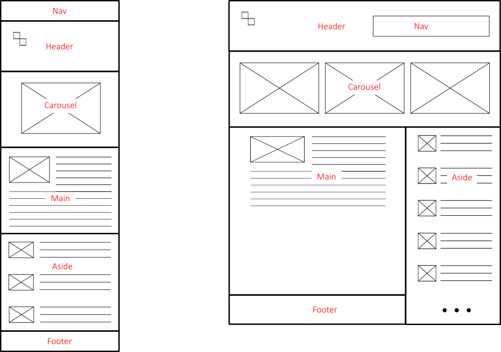

# **Korisnička sučelja - upute za laboratorijske vježbe**

## FESB, Računarstvo, 2017/18

Osnovni cilj predmeta **Korinička sučelja** je upoznati studente s važnim aspekatima procesa dizajna (sučelja) usmjerenog krajnjim korisnicima. Studenti će usvojene principe i heuristike (eng. _usability heuristics_) primjeniti u okviru praktičnog projekta koji će realizirati tijekom semestra. Projekt će biti zasnovan na [React JavaScript bibilioteci za izradu korisničkih sučelja](https://reactjs.org).

Na ovom GitHub repozitoriju profesor će objavljivati upute, dijelove koda, konfiguracijske skripte, i druge sugestije a sa svrhom povećanja produktivnosti studenta tijekom rada na projektu.

### Table of Contents

- [Bits of JavaScript](#bits-of-javascript)
- [Bits of React](#bits-of-react)
- [Bits of CSS Layout](#bits-of-layout)

### Bits of JavaScript

U direktoriju [bits-of-javascript](/bits-of-javascript) možete naći niz JavaScript datoteka koje demonstriraju neke specifičnosti JavaScript programskog jezika. Skripte možete izvoditi direktno u konzolnom prozoru preglednika, iako preporučamo da koristite [Node.js](https://nodejs.org) odnosno [`nodemon`](https://nodemon.io) aplikaciju za automatsko pokretanje istih u konzolnom prozoru vašeg operacijskog sustava.

### Bits of React

U direktoriju [bits-of-react](/bits-of-react) možete naći niz primjera React komponenti. Osim JavaScript datoteka koje opisuju pojedine komponente, u direktoriju možete naći i popratne konfiguracijske skripte (npr., `webpack.config.js` i `package.json`) koje automatiziraju i olakšavaju razvoj komponenti kao i genriranje produkcijskog koda.

Primjere iz ovog direktorija možete pokretati na nekoliko načina kako je opisano u nastavku. Prije svega trebate instalirati stabilnu verziju [Node.js-a](https://nodejs.org). Nakon uspješne instalacije testirajte, u komandnom prozoru, `npm` aplikaciju. `npm` aplikaciju će te koristiti za instalaciju potrebnih JavaScript modula/applikacija/biblioteka kao i za pokretanje razvojnog servera.

#### Koraci za pokretanje primjera

1. Nakon što ste klonirali ovaj repozitoriji (ili kopirali ovaj direktorij), u komandnom prozoru pozicionirajte se u direktorij s odgovarajućom komponentom (npr. `first-component`) i izvršite sljedeću naredbu:
    ```Bash
    npm install
    ```
    `npm` će konzultirati `package.json` datoteku te dohvatiti i instalirati sve skripte/module navedene u istoj. Nove skripte i moduli bit će spremljeni u `node_modules` direktorij.

2. U ovom koraku pokrećete razvojni web server koji će posluživati web starnicu s implementiranom komponentom. Server pokrećete sljedećom naredbom:
    ```Bash
    npm run dev-server
    ```
    Detalji vezani uz razvojni web server (npr. port, datoteke koje će posluživati, podrška za _live_ i _hot reload_ i drugo) navedeni su u konfiguracijskoj datoteci `wepack.config.js`.

3. Konačno, otvorite preferirani preglednik i u adresnoj traci unesite **localhost:3000**.

**NAPOMENA**: Ukoliko želite primjer pokrenuti bez uporabe razvojnog web servera, u koraku 2. potrebano je dati nalog za generiranje produkcijskog koda:
    ```Bash
    npm run prod
    ```
Ova naredba će generirati `index.html` i odgovarajuće JavaScript/CSS datoteke, te ih pohraniti u direktorij `first-component/public`. Primjer sada možete pokrenuti jednostavnim otvaranjem datoteke `index.html` u odgovarajućem pregledniku.

### Bits of CSS Layout

U direktoriju [bits-of-layout](/bits-of-layout) možete naći primjer korištenja CSS _Grid_ i _Flexbox_ sustava za  realizaciju složenih web starnica. Primjer također demonstrira uporabu `@support` i `@media` upita. Testirajte promjenom veličine prozora (_breakpoint_ za mobilnu verziju postavljen je na 400px).

Na slici u nastavu su dane skice mobilne i desktop verzije stranice koje želimo realizirati.

<p align="center">
    
</p>

Nekoliko zanimljivih referenci:

- [Grid by Example by Rachel Andrew](https://gridbyexample.com)

- [CSS Grid Layout by MDN](https://developer.mozilla.org/en-US/docs/Web/CSS/CSS_Grid_Layout)

- [A Complete Guide to Flexbox by CSS-TRICKS](https://css-tricks.com/snippets/css/a-guide-to-flexbox/)

- [A Complete Guide to Grid by CSS-TRICKS](https://css-tricks.com/snippets/css/complete-guide-grid/)